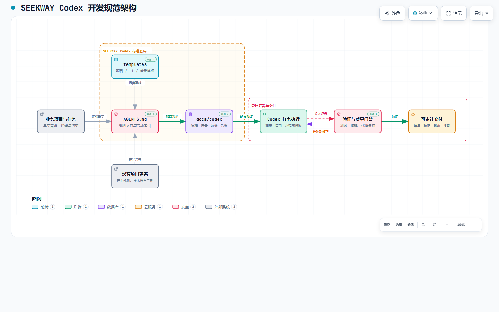
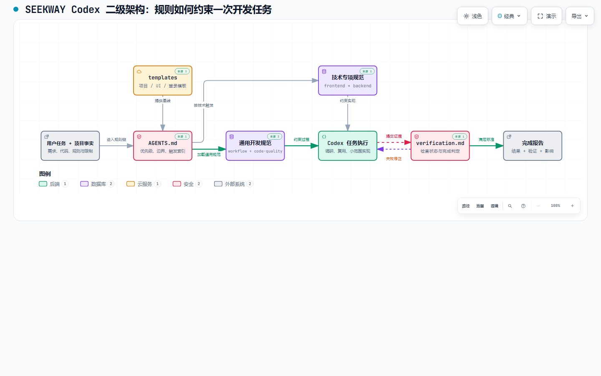
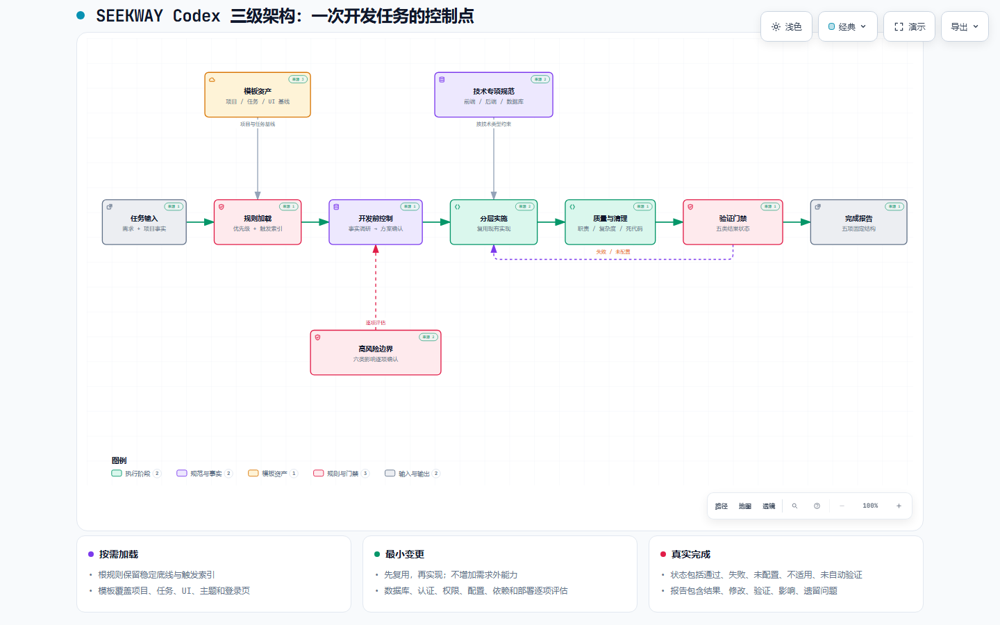

# SEEKWAY Codex 开发规范

本仓库保存 SEEKWAY Codex 开发规范，约束需求分析、代码修改、验证和结果汇报。

## 项目架构



`AGENTS.md` 是规则入口，Codex 按任务加载 `docs/codex` 专项规范，并使用模板、质量门禁和完成报告约束交付。

### 二级架构：规则执行链



二级架构说明通用规范、技术专项规范和验证规范如何共同约束任务。

### 三级架构：开发任务控制点



三级架构列出规则加载、开发前确认、分层实施、质量清理、验证状态和完成报告，并标出高风险影响与失败修正闭环。

## 项目价值

### 对公司

- 统一规则、技术基线和交付标准，减少团队理解偏差。
- 复用项目、任务和界面模板，减少重复建设和人员切换成本。
- 通过验证门禁和固定完成报告控制变更风险并保留交付证据。

### 对个人

- 明确需求调研、方案确认、实现和验证的工作路径，减少遗漏与返工。
- 提供修改边界和风险检查项，便于判断复杂任务的影响。
- 通过模板复用、质量检查和固定报告减少重复劳动，使产出更容易评审和复用。

## 仓库内容

- [AGENTS.md](AGENTS.md)：始终生效的规则和专项规范索引。
- [docs/codex](docs/codex)：按任务加载的开发与验证规范。
- [templates](templates)：项目文档、主题、界面规范和登录页模板。
- [CHANGELOG.md](CHANGELOG.md)：版本变更记录。

首次使用：

```text
请读取当前项目的 AGENTS.md 和 README，只概括项目规则，不要修改文件。
```

## 项目负责人配置

### 新项目

1. 将根目录 `AGENTS.md` 复制到项目根目录。
2. 将 `docs/codex` 复制到项目的 `docs/codex`，保留 `AGENTS.md` 中的专项规范索引。
3. 使用 `templates/project-README-template.md` 建立 README，并填写业务边界、实际检查命令和项目差异。
4. 将 `templates/gitignore-template` 复制为根目录 `.gitignore`，再补充项目产物。
5. 新 Web 项目按 `docs/codex/frontend.md` 安装 Ant Design 6 和 `@ant-design/icons` 6，并复制两个 SEEKWAY 主题模板。
6. 将四份 `web-ui-*-template.md` 分别复制为 `docs/web-ui-standard.md`、`docs/web-ui-layout-standard.md`、`docs/web-ui-form-standard.md` 和 `docs/web-ui-data-standard.md`，填写设计来源和项目差异。
7. 使用 `templates/task-template.md` 编写任务；仅在子目录确有独立规则时创建嵌套 `AGENTS.md`。

### 现有项目

先审计现有规则和配置，再按 `docs/codex/workflow.md` 差异合并。不得用公司模板覆盖已有规则或为符合默认技术栈进行全量迁移。项目 README 须记录规范基线版本、接入日期、项目差异和真实检查命令。

## Web 界面规范

新 Web 项目默认使用 Ant Design 6、`@ant-design/icons` 6 和 SEEKWAY 主题。工程约束见 `docs/codex/frontend.md`，界面规则见 `docs/web-ui-standard.md`。设计参考：[SEEKWAY Web UI Kit V1.2.0](https://www.figma.com/design/eed9GukOv7zM7n04Lu1xUl)。

现有项目无需自动拆分界面规范；迁移时保留原规则并更新专项索引。

## 登录页模板

入口：[templates/seekway-login](templates/seekway-login)。该模板可直接运行，但不提供认证服务。默认使用 C 版错位字场，品牌文案为 `SEEK THE WAY YOU WANT. LIVE THE LIFE YOU FOUND.`。

本地预览（Windows PowerShell 与 Linux 命令相同；Node.js 22.12 及以上）：

```sh
cd templates/seekway-login
npm ci
npm run dev
```

打开终端显示的地址。任意非空输入默认提示“尚未连接登录服务”；加 `?demo=success` 可验证成功状态。不要输入真实凭据，预览不会发送或存储输入值。

接入业务项目：

1. 将 `src/SeekwayLogin.tsx`、`src/BrandArtwork.tsx`、`src/login-theme.ts`、`src/seekway-login.css`、`src/brand-artwork.css` 和完整 `src/assets/` 复制到登录模块；不要复制 `main.tsx` 的模拟回调。
2. 复用项目根级 `ConfigProvider`、Ant Design `App` 和 SEEKWAY 主题，不重复复制已有主题文件。组件内部的局部 Provider 只调整登录页尺寸、中文和必要对比度。
3. 将 `onLogin` 接入现有认证 Service。认证、Token 管理和跳转由业务项目负责。

```tsx
<SeekwayLogin
  systemName="登录工作台"
  helpText="账号问题请联系系统管理员"
  onLogin={handleLogin}
/>
```

`handleLogin` 接收 `{ account, password }`，返回 `{ success: true }` 或 `{ success: false, message: "脱敏后的提示" }`。模板不提供注册、找回密码、验证码或单点登录；现有项目是否替换登录页由负责人决定。

接入边界：

- 业务文案通过 `systemName` 和 `helpText` 配置。
- Logo、slogan、品牌色和默认字场是品牌基线；调整前须由项目负责人确认，视觉参数以模板代码为准。
- 桌面展示艺术字场；窄屏改为双句文案并保留 Logo 和完整表单，不添加循环动效。

复制模板时，在业务项目 README 中记录本仓库地址、来源提交号和接入日期。后续按 [CHANGELOG](CHANGELOG.md) 差异合并并保留业务逻辑；视觉调整可选同步，功能和可访问性修复按受影响文件同步。

检查环境初始化（与检查命令分开执行）：

```sh
npm ci
npx playwright install chromium
```

Windows / Linux 通用检查：

```sh
npm run check
npm ls antd @ant-design/icons react react-dom
```

`check` 包含格式、ESLint、类型、浏览器测试、构建、jscpd、knip 和循环依赖检查；模板没有后端，`vulture` 不适用。使用本机 Chrome 时，PowerShell 执行 `$env:PLAYWRIGHT_CHANNEL='chrome'; npm run check`，Linux 执行 `PLAYWRIGHT_CHANNEL=chrome npm run check`。检查命令不安装依赖。

品牌标记来自 [Figma 反白 Logo 节点](https://www.figma.com/design/eed9GukOv7zM7n04Lu1xUl?node-id=38-17)，使用原始 SVG 和字标间距，不属于开源字体许可证范围。Anton 和 Inter 字体以 WOFF2 本地加载，运行时不访问字体 CDN；许可证随 `src/assets` 分发，构建产物必须包含 `Fonts-LICENSE.txt`。

## 开发辅助资源（可选）

按当前问题选择，不要求每个任务都使用，也不作为项目启动或验收的前提。

| 遇到的问题 | 推荐资源 | 使用目标 |
| --- | --- | --- |
| 不知道如何准确描述需求或交互 | [VibeHub Skill](https://github.com/oil-oil/vibe-hub-skill) | 将口语描述整理成准确需求，保持原意并解释相关术语 |
| 不理解需求讨论中的产品概念 | [VibeHub 产品术语](https://vibe-hub.org/topics/product) | 查阅用户故事、用户流程、PRD、MVP 等概念；直接访问，无需安装 |
| 架构或流程复杂，文字难以说明 | [Archify](https://github.com/tt-a1i/archify) | 用交互图示说明关键关系，辅助方案讨论和项目交接 |
| 不知道已有实现在哪里、修改会影响什么 | [CodeGraph](https://github.com/colbymchenry/codegraph) | 通过代码索引查找符号、调用链和依赖，定位可复用实现 |

- 资源推荐不代表安装授权，不得自动修改个人配置或加入业务生产依赖；CodeGraph 索引由项目负责人决定。
- 术语、图示和索引须与项目事实核对，不能替代需求确认、测试和代码质量检查。工具不可用时继续按现有方式开发，权限和敏感信息边界见 [开发流程与项目边界](docs/codex/workflow.md)。

## 规则加载方式

规则优先级、目录作用域和 `AGENTS.override.md` 处理方式见 [开发流程与项目边界](docs/codex/workflow.md)；加载机制以 [Codex 官方说明](https://learn.chatgpt.com/docs/agent-configuration/agents-md) 为准。

## 仓库检查

Windows PowerShell 与 Linux/CI 使用同一命令检查文档差异：

```sh
git diff --check
```

登录模板的完整检查命令见“登录页模板”。

## 规范版本

版本号使用 `MAJOR.MINOR.PATCH`：

- **PATCH**：修正错别字、措词或不改变执行行为的说明。
- **MINOR**：新增规则、模板、检查能力或向后兼容的默认能力。
- **MAJOR**：删除或反转现有规则、改变默认技术栈，或要求现有项目迁移。

版本发布后不得修改同一版本的内容。后续变化必须增加版本号，并在 CHANGELOG 中记录新增、变更和删除的规则。

规范维护和发布检查见 [验证与完成报告规范](docs/codex/verification.md)。

## 当前版本

- 版本：V1.8.2
- 发布日期：2026-09-12
- 仓库定位：规范源仓库，接入日期和项目差异不适用。
- 变更记录：[CHANGELOG.md](CHANGELOG.md)
