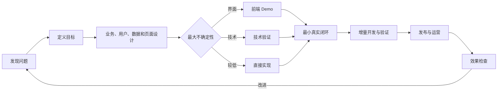
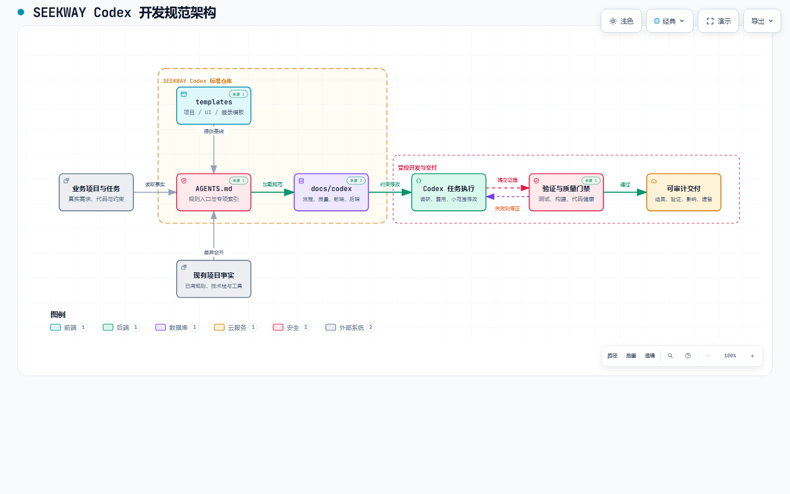

# SEEKWAY Codex 开发规范

本仓库保存 SEEKWAY Codex 开发规范，约束需求分析、代码修改、验证和结果汇报。

## 不会开发也能使用

这是规则源仓库，不是需要直接运行的业务系统。普通使用者不需要先学习 Git、命令行或编程。

### 第一次使用

1. 新项目先创建一个空文件夹；现有项目打开原项目根目录。不要打开规范 ZIP 的解压目录。
2. 在该目录中新建 Codex 任务，复制下面对应的提示词。
3. 回答业务问题，阅读 Codex 用通俗语言给出的修改、风险和恢复方式。
4. 确认需求、方案或 Demo 后再允许修改。
5. 根据验证结果决定发布、继续修改或停止。

### 新项目

```text
我没有开发经验，当前目录是准备创建的业务项目。

请从 https://github.com/songtu2025/seekway-codex-standards 获取规范，使用 README 标注的当前已发布版本对应的标签 ZIP。若无法取得该版本，先说明原因并询问我是否使用同版本的受控离线 ZIP；只有我明确要求试用主分支时才使用 main.zip。将 ZIP 下载并解压到当前项目之外的临时目录，不要使用 git clone，也不要把整个规范仓库放入当前项目。

先检查当前目录、规范来源、Git 状态和回退条件，再用通俗语言说明需要接入的文件、需要我补充的信息、风险和验证方式，等我确认后再执行。完成后记录接入来源、规范版本、日期和版本控制状态，并提醒我新建 Codex 任务验证规则加载。先不要开发业务功能。
```

### 现有项目

```text
我没有开发经验，当前目录是已有的业务项目。

请从 https://github.com/songtu2025/seekway-codex-standards 获取规范，使用 README 标注的当前已发布版本对应的标签 ZIP。若无法取得该版本，先说明原因并询问我是否使用同版本的受控离线 ZIP；只有我明确要求试用主分支时才使用 main.zip。将 ZIP 下载并解压到当前项目之外的临时目录，不要使用 git clone，也不要把整个规范仓库放入当前项目。

先检查当前目录、规范来源、Git 状态和回退条件，再只读审计现有规则、技术栈和检查命令。保留有效规则，用通俗语言说明差异、风险和恢复方式，等我确认后再备份需要修改的规则文件并合并。完成后记录接入来源、规范版本、日期和版本控制状态，并提醒我新建 Codex 任务验证规则加载。
```

### 无 Git 接入说明

- 接入规范不需要 Git；正式开发仍应使用 Git 或其他受控版本管理。没有 Git 时，Codex 不能声称已经提交、推送或具备可靠回滚能力。
- 已发布版本使用标签 ZIP。只有试用主分支最新内容时才使用 [main.zip](https://github.com/songtu2025/seekway-codex-standards/archive/refs/heads/main.zip)；无法访问 GitHub 时，使用公司受控共享位置提供的同版本 ZIP。
- ZIP 只在项目外的临时目录中审计。接入前必须确认来源和版本，接入后不得把完整规范仓库留在业务项目中。
- 没有 Git 的现有项目在修改前须将目标规则文件备份到项目外。该备份只用于本次恢复，不能代替版本管理。
- 接入后新建 Codex 任务并发送：`请列出本任务实际加载的 AGENTS.md 路径，并概括关键规则，不要修改文件。`

### 日常提需求

```text
我没有开发经验。请先不要写代码，先通过提问帮我区分真实业务目标、必须保留的规则、现有工具的限制和操作习惯，再整理适合 Web 系统的流程、验收标准和方案，等我确认后再开发。

我的想法是：在这里描述想解决的问题。
```

## AI 协作开发流程


```mermaid
flowchart LR
    A[发现问题] --> B[定义目标]
    B --> C[业务、用户、数据和页面设计]
    C --> D{最大不确定性}
    D -->|界面| E[前端 Demo]
    D -->|技术| F[技术验证]
    D -->|较低| G[直接实现]
    E --> H[最小真实闭环]
    F --> H
    G --> H
    H --> I[增量开发与验证]
    I --> J[发布与运营]
    J --> K[效果检查]
    K -->|改进| A
```

任务分级、各阶段的确认条件和效果复查要求见 [开发流程与项目边界](docs/codex/workflow.md)。

## 项目架构



`AGENTS.md` 是规则入口，Codex 按任务加载 `docs/codex` 专项规范，并使用模板、质量门禁和完成报告约束交付。

按需查看[规则执行链](docs/images/seekway-codex-standards-level2-architecture.png)和[单次开发任务的控制点](docs/images/seekway-codex-standards-level3-architecture.png)。

## 仓库内容

- [AGENTS.md](AGENTS.md)：始终生效的规则和专项规范索引。
- [docs/codex](docs/codex)：按任务加载的开发与验证规范。
- [templates](templates)：项目文档、主题、界面规范和登录页模板。
- [CHANGELOG.md](CHANGELOG.md)：版本变更记录。

## 维护者接入说明（普通使用者可跳过）

### 新项目

1. 将根目录 `AGENTS.md` 复制到项目根目录。
2. 将 `docs/codex` 复制到项目的 `docs/codex`，保留 `AGENTS.md` 中的专项规范索引。
3. 使用 `templates/project-README-template.md` 建立 README，并填写业务边界、实际检查命令和项目差异。
4. 将 `templates/gitignore-template` 复制为根目录 `.gitignore`，再补充项目产物。
5. 新 Web 项目按 `docs/codex/frontend.md` 安装 Ant Design 6 和 `@ant-design/icons` 6；有图表需求时安装 `echarts`，并复制两个 SEEKWAY 主题模板。
6. 将四份 `web-ui-*-template.md` 分别复制为 `docs/web-ui-standard.md`、`docs/web-ui-layout-standard.md`、`docs/web-ui-form-standard.md` 和 `docs/web-ui-data-standard.md`，填写设计来源和项目差异。
7. 使用 `templates/task-template.md` 编写任务；仅在子目录确有独立规则时创建嵌套 `AGENTS.md`。

### 现有项目

先审计现有规则和配置，再按 `docs/codex/workflow.md` 差异合并。不得用公司模板覆盖已有规则或为符合默认技术栈进行全量迁移。项目 README 须记录规范基线版本、接入来源、接入日期、版本控制状态、加载验证、项目差异和真实检查命令。

## Web 界面规范

新 Web 项目默认使用 Ant Design 6、`@ant-design/icons` 6 和 SEEKWAY 主题；需要图表时默认使用 Apache ECharts。工程约束见 `docs/codex/frontend.md`，界面规则见 `docs/web-ui-standard.md`。设计参考：[SEEKWAY Web UI Kit V1.2.0](https://www.figma.com/design/eed9GukOv7zM7n04Lu1xUl)。

新建、明显重设计或方向不明确的界面，按 [界面设计发现与探索](docs/codex/interface-design.md) 确定是否需要多方案探索。成熟模式内的局部任务继续复用现有设计。

现有项目无需自动拆分界面规范；迁移时保留原规则并更新专项索引。

### 设计探索工具

[templates/design-exploration](templates/design-exploration) 提供 Python 3.10 及以上可运行的标准库工具。先核对示例中的任务假设、维度与排除理由，再建立本任务配置。Windows PowerShell 与 Linux 使用相同命令：

```sh
python -B templates/design-exploration/sample.py --space templates/design-exploration/example.json --seed 41382 --count 16
```

工具输出 JSON，记录配置、版本、候选和覆盖缺口。采样完成不代表设计质量通过。业务项目的接入方式、配置字段、退出码及不可运行时的处理，见[专项规范第 4 节](docs/codex/interface-design.md#4-覆盖安排与程序采样)。

## 登录页模板

入口：[templates/seekway-login](templates/seekway-login)。该模板可直接运行，但不提供认证服务。默认使用 C 版错位字场，品牌文案为 `SEEK THE WAY YOU WANT. LIVE THE LIFE YOU FOUND.`。

本地预览（Windows PowerShell 与 Linux 命令相同；Node.js 22.12 及以上）：

```sh
cd templates/seekway-login
npm ci
npm run dev
```

打开终端显示的地址。任意非空输入默认提示“尚未连接登录服务”；加 `?demo=success` 可验证成功状态。不要输入真实凭据，预览不会发送或存储输入值。

接入业务项目：

1. 将 `src/SeekwayLogin.tsx`、`src/BrandArtwork.tsx`、`src/login-theme.ts`、`src/seekway-login.css`、`src/brand-artwork.css` 和完整 `src/assets/` 复制到登录模块；不要复制 `main.tsx` 的模拟回调。
2. 复用项目根级 `ConfigProvider`、Ant Design `App` 和 SEEKWAY 主题，不重复复制已有主题文件。组件内部的局部 Provider 只调整登录页尺寸、中文和必要对比度。
3. 将 `onLogin` 接入现有认证 Service。认证、Token 管理和跳转由业务项目负责。

```tsx
<SeekwayLogin
  systemName="登录工作台"
  helpText="账号问题请联系系统管理员"
  onLogin={handleLogin}
/>
```

`handleLogin` 接收 `{ account, password }`，返回 `{ success: true }` 或 `{ success: false, message: "脱敏后的提示" }`。模板不提供注册、找回密码、验证码或单点登录；现有项目是否替换登录页由负责人决定。

接入边界：

- 业务文案通过 `systemName` 和 `helpText` 配置。
- Logo、slogan、品牌色和默认字场是品牌基线；调整前须由项目负责人确认，视觉参数以模板代码为准。
- 桌面展示艺术字场；窄屏改为双句文案并保留 Logo 和完整表单，不添加循环动效。

复制模板时，在业务项目 README 中记录本仓库地址、来源提交号和接入日期。后续按 [CHANGELOG](CHANGELOG.md) 差异合并并保留业务逻辑；视觉调整可选同步，功能和可访问性修复按受影响文件同步。

检查环境初始化（与检查命令分开执行）：

```sh
npm ci
npx playwright install chromium
```

Windows / Linux 通用检查：

```sh
npm run check
npm ls antd @ant-design/icons react react-dom
```

`check` 包含格式、ESLint、类型、浏览器测试、构建、jscpd、knip 和循环依赖检查；模板没有后端，`vulture` 不适用。使用本机 Chrome 时，PowerShell 执行 `$env:PLAYWRIGHT_CHANNEL='chrome'; npm run check`，Linux 执行 `PLAYWRIGHT_CHANNEL=chrome npm run check`。检查命令不安装依赖。

品牌标记来自 [Figma 反白 Logo 节点](https://www.figma.com/design/eed9GukOv7zM7n04Lu1xUl?node-id=38-17)，使用原始 SVG 和字标间距，不属于开源字体许可证范围。Anton 和 Inter 字体以 WOFF2 本地加载，运行时不访问字体 CDN；许可证随 `src/assets` 分发，构建产物必须包含 `Fonts-LICENSE.txt`。

## 开发辅助资源（可选）

按当前问题选择，不要求每个任务都使用，也不作为项目启动或验收的前提。

| 遇到的问题 | 推荐资源 | 使用目标 |
| --- | --- | --- |
| 不知道如何准确描述需求或交互 | [VibeHub Skill](https://github.com/oil-oil/vibe-hub-skill) | 将口语描述整理成准确需求，保持原意并解释相关术语 |
| 不理解需求讨论中的产品概念 | [VibeHub 产品术语](https://vibe-hub.org/topics/product) | 查阅用户故事、用户流程、PRD、MVP 等概念；直接访问，无需安装 |
| 架构或流程复杂，文字难以说明 | [Archify](https://github.com/tt-a1i/archify) | 用交互图示说明关键关系，辅助方案讨论和项目交接 |
| 不知道已有实现在哪里、修改会影响什么 | [CodeGraph](https://github.com/colbymchenry/codegraph) | 通过代码索引查找符号、调用链和依赖，定位可复用实现 |
| 新建或重塑 Web 界面，需要明确视觉方向 | [Frontend Design Skill](https://github.com/anthropics/skills/tree/main/skills/frontend-design) | 基于业务语境规划配色、字体、布局、动效和界面文案，减少模板化设计 |

资源配置和权限边界见 [开发流程与项目边界](docs/codex/workflow.md)。用户拒绝配置后继续按现有方式开发；术语、图示和索引仍须与项目事实核对，不能替代需求确认、测试和代码质量检查。

经用户确认后，可选安装 Frontend Design Skill：

```sh
npx skills add https://github.com/anthropics/skills --skill frontend-design
```

该 Skill 来自 Anthropic 的 Claude Skills 示例仓库，并非 Codex 官方资源；安装前应审查当前版本和 Apache-2.0 许可证。

## 规则加载方式

规则优先级、目录作用域和 `AGENTS.override.md` 处理方式见 [开发流程与项目边界](docs/codex/workflow.md)；加载机制以 [Codex 官方说明](https://developers.openai.com/zh-Hans/docs/agent-configuration/agents-md) 为准。

## 仓库检查

Windows PowerShell 与 Linux/CI 使用同一命令检查文档差异：

```sh
git diff --check
```

登录模板的完整检查命令见“登录页模板”。

设计探索工具的 Windows / Linux 通用检查命令如下。Python 环境需预先准备 Ruff、Mypy、Vulture，代码重复检查需预先准备 jscpd；这些是开发检查工具，检查阶段不安装依赖：

使用 npm 临时工具缓存时，先单独执行 `npm exec --yes --package=jscpd@5.2.0 -- jscpd --version` 初始化，之后重复检查使用离线命令。

```sh
python -B -m unittest discover -s templates/design-exploration/tests -v
ruff format --check templates/design-exploration
ruff check templates/design-exploration
mypy --strict templates/design-exploration
vulture templates/design-exploration --min-confidence 100
npx --offline --no --package=jscpd@5.2.0 jscpd templates/design-exploration --format python --threshold 0 --reporters console
```

该模板没有前端模块，Knip 不适用；规范路由和设计场景仍须按 `docs/codex/verification.md` 人工核对。

## 规范版本

版本号使用 `MAJOR.MINOR.PATCH`：

- **PATCH**：修正错别字、措词或不改变执行行为的说明。
- **MINOR**：新增规则、模板、检查能力或向后兼容的默认能力。
- **MAJOR**：删除或反转现有规则、改变默认技术栈，或要求现有项目迁移。

版本发布后不得修改同一版本的内容。后续变化必须增加版本号，并在 CHANGELOG 中记录新增、变更和删除的规则。发布、标签和归档要求见 [开发流程与项目边界](docs/codex/workflow.md)，检查项见 [验证与完成报告规范](docs/codex/verification.md)。

## 版本状态

- 当前已发布版本：[V2.0.0 标签 ZIP](https://github.com/songtu2025/seekway-codex-standards/archive/refs/tags/v2.0.0.zip)（2026-10-03），变更见 [CHANGELOG.md](CHANGELOG.md)。
- 当前工作内容与已发布 V2.0.0 一致；后续变更使用新版本号，不修改已发布标签。
